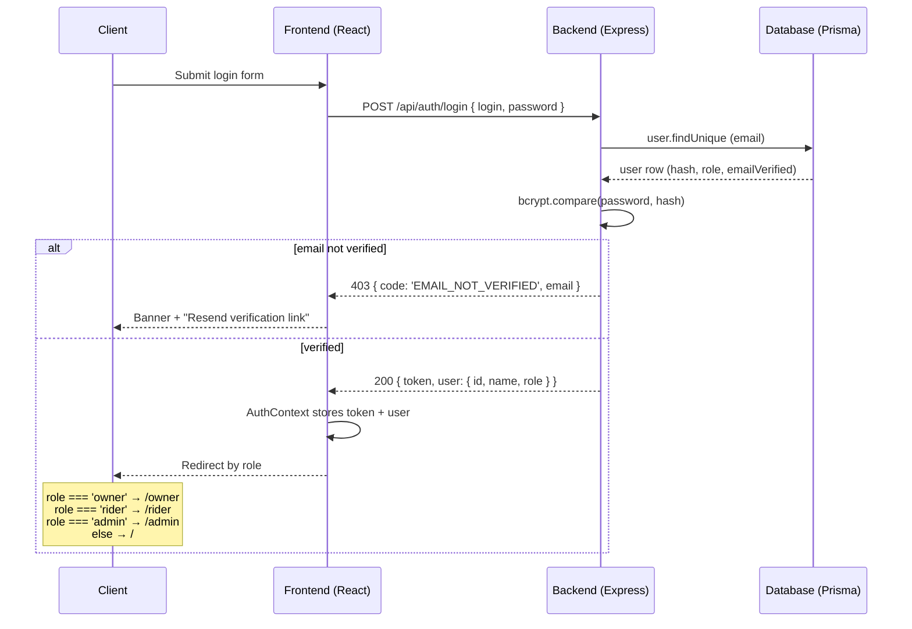
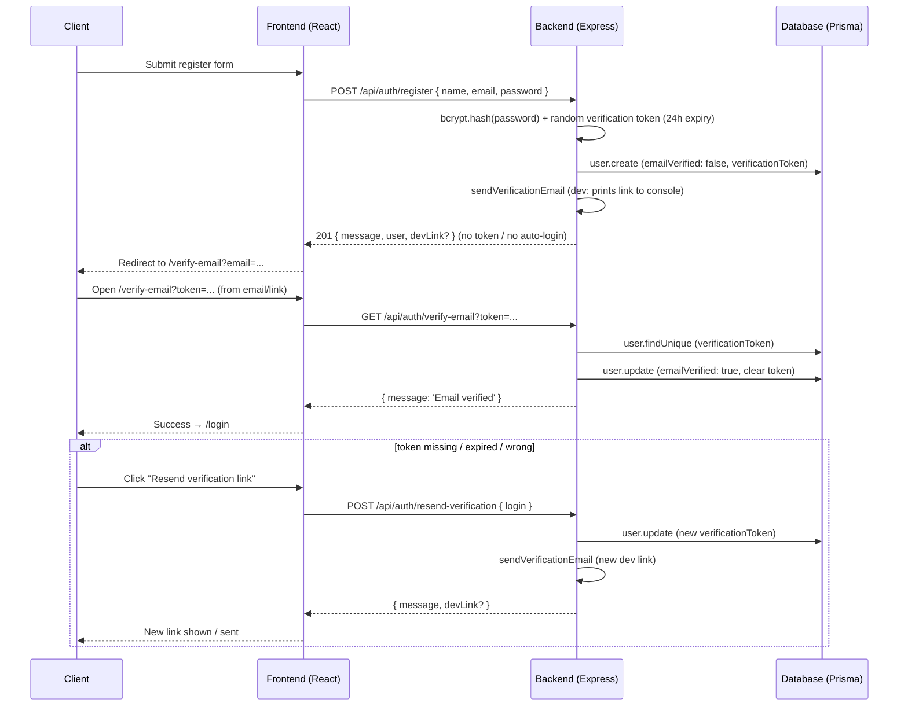
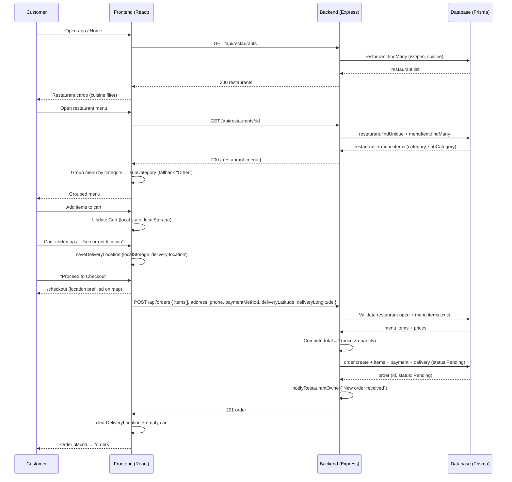
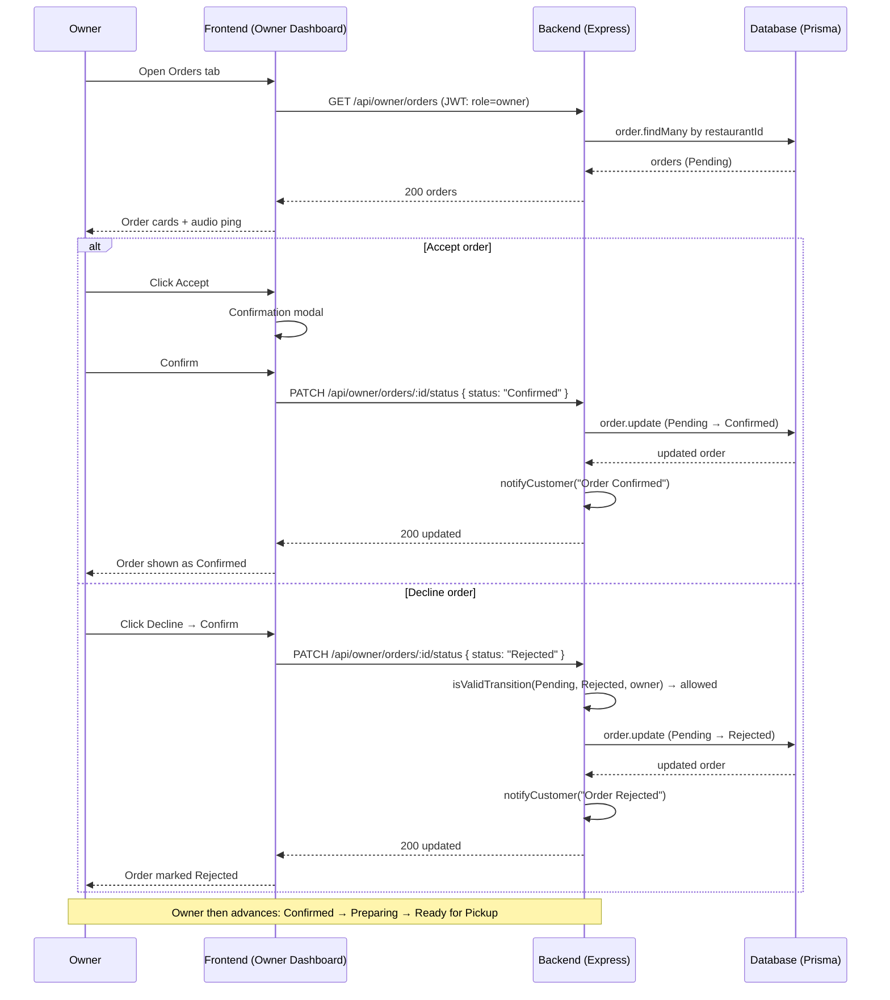
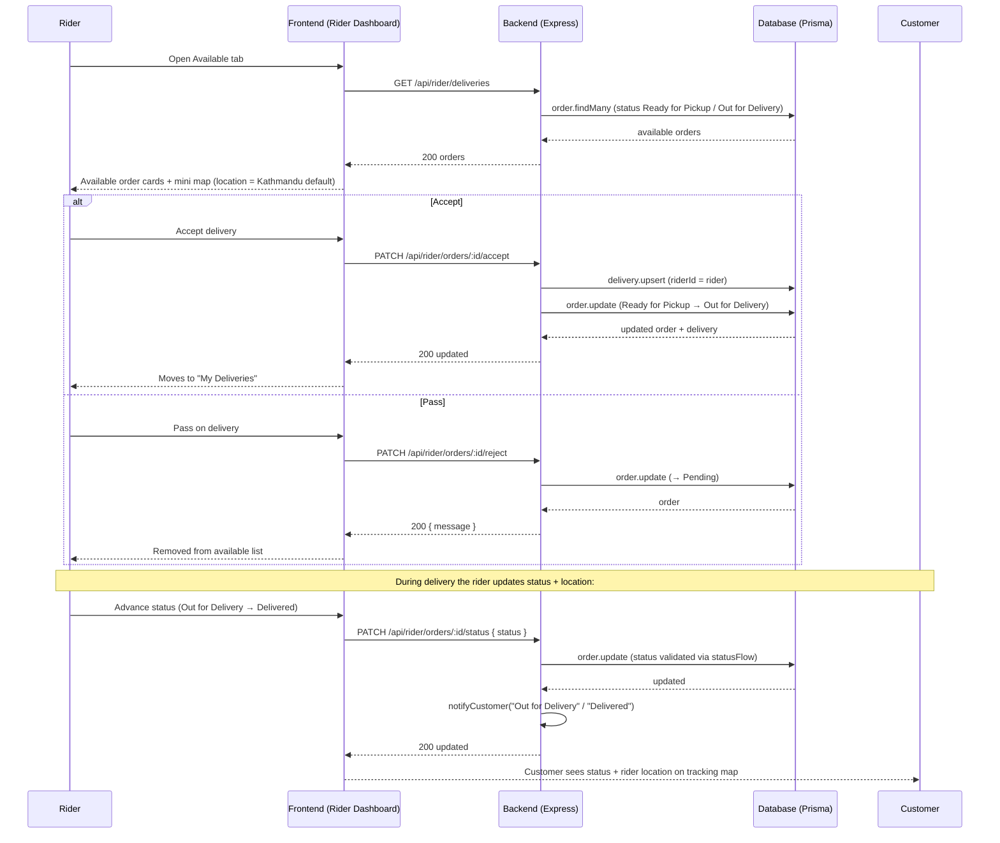
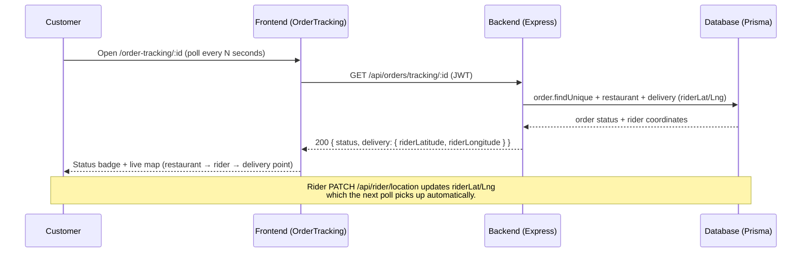
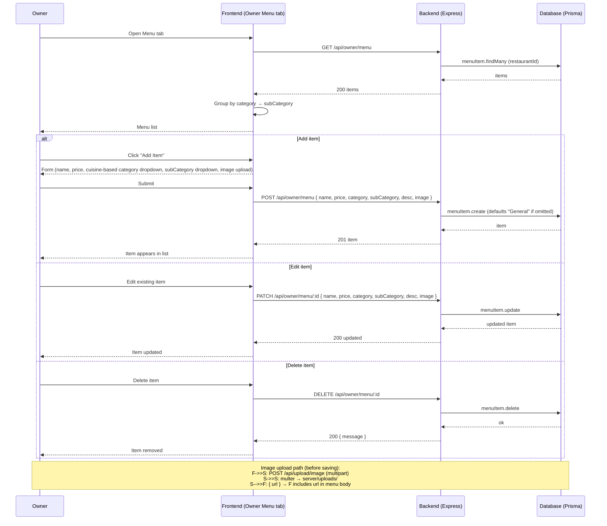
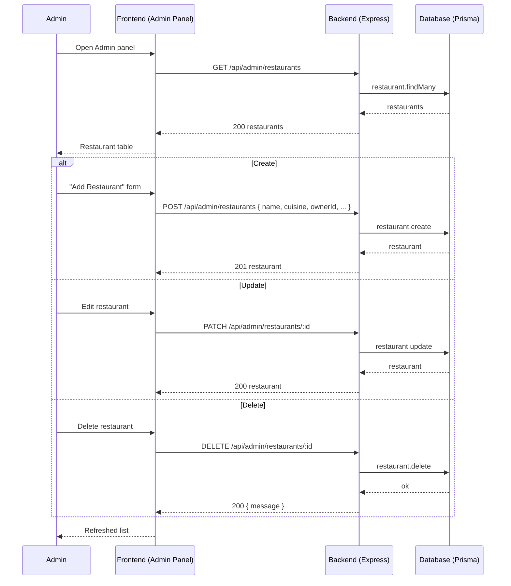
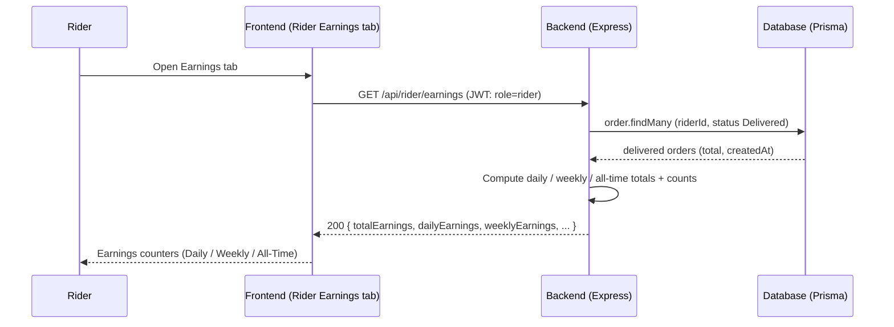
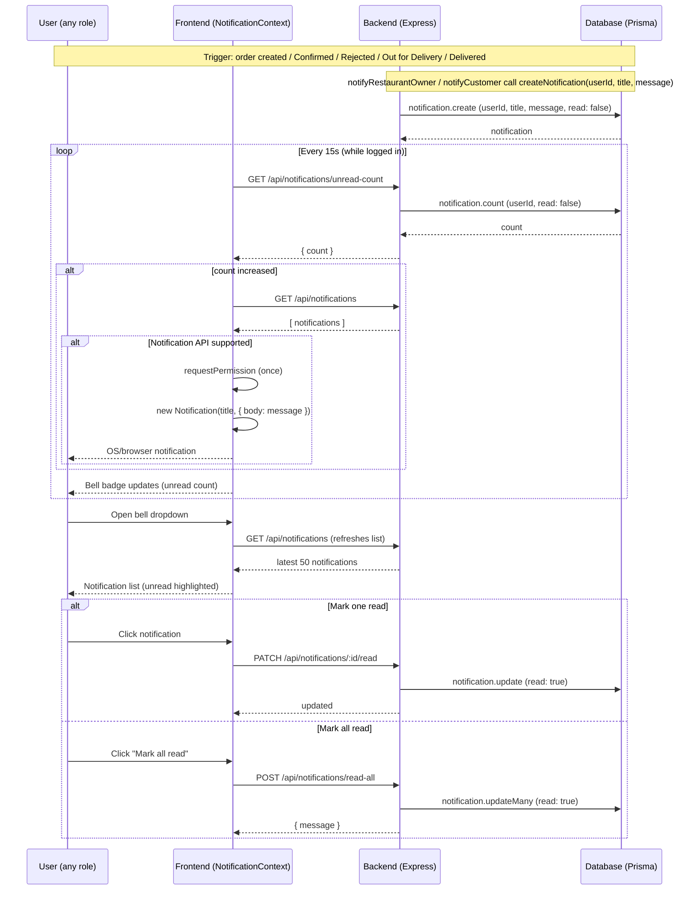

# Sequence Diagrams

> Rendered with [Mermaid](https://mermaid.js.org). Copy any block into https://mermaid.live to view, or open this file in a Markdown viewer with Mermaid support (VS Code + "Markdown Preview Mermaid Support").

## Actors & Roles

| Actor | Role | Accesses |
|---|---|---|
| Customer | Places orders, tracks delivery | `/`, `/restaurant/:id`, `/cart`, `/checkout`, `/order-tracking/:id` |
| Owner | Manages restaurant + menu, confirms orders | `/owner` (Orders / Menu / Settings) |
| Rider | Accepts deliveries, updates status + location, views earnings | `/rider` (Available / My Deliveries / Earnings) |
| Admin | Full restaurant CRUD, app oversight | `/admin` |
| Backend | Express + Prisma (MySQL 8) | `/api/*` |

---

## 1. Authentication & Role-Based Redirect

---

## 1b. Registration & Email Verification

---

## 2. Browse Restaurants & Place an Order

---

## 3. Order Fulfillment (Owner)

---

## 4. Delivery (Rider)

---

## 5. Live Tracking (Customer)

---

## 6. Menu Management (Owner)

---

## 7. Admin — Restaurant CRUD

---

## 8. Rider Earnings

---

---

## 9. Notifications (In-App Bell + Browser Push)

---

## Security Notes (from `SECURITY_CHECKLIST.md`)

- Every `/api/*` mutating route is behind `csrfProtection` (skipped in `NODE_ENV=test`).
- Auth uses `authenticate` (JWT) + `authorize(role)` middleware per route group.
- Order status changes are validated with `isValidTransition` / `TERMINAL_STATUSES` to block illegal transitions and terminal-order edits.
- Passwords are hashed with bcrypt; no secrets committed.
- Email verification gates the first login (`403 EMAIL_NOT_VERIFIED`); the verify/resend routes rotate the one-time token with a 24h expiry.
- Notification endpoints are authenticated and scoped to the requesting `userId` (no cross-user reads/writes).
- Uploads are behind `authenticate`, size-limited (5MB) and filtered to `jpeg/png/gif/webp` mime types.
